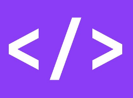

<p align="center">
   
</p>

<p align="center">	
  

  

  
</p>

> :rocket: A simple web scrapper developed during IBM Behind the Code Challenge #03 | FIAP


# :pushpin: Table of Contents
 
* [Technologies](#computer-technologies)
* [Features](#rocket-features)
* [How to Run](#construction_worker-how-to-run)
* [Found a bug?](#bug-issues)
* [License](#closed_book-license)

-----

# :computer: Technologies
This project was made using the following technologies:

* [Beautiful Soup](https://www.crummy.com/software/BeautifulSoup/bs4/doc/)      
* [Python built-in modules](https://docs.python.org/3/py-modindex.html)         
* Custom libraries

# :rocket: Features

* Web scrapping in TED Talk transcriptions.
* Web scrapping Olhar Digital articles.
* Web scrapping StartSe articles.

# :construction_worker: How to run
```bash
# Clone this repo
$ git clone https://github.com/vcwild/btc-web-scraper.git
```
### 📦 Run Crawlers

```bash
# Run crawlers
$ python3 main.py
```

# :bug: Issues

Found a bug? Feel free to post an [issue](https://github.com/vcwild/btc-web-scrapper/issues) with title and description.


# :closed_book: License

This project is under the [MIT license](./LICENSE).
